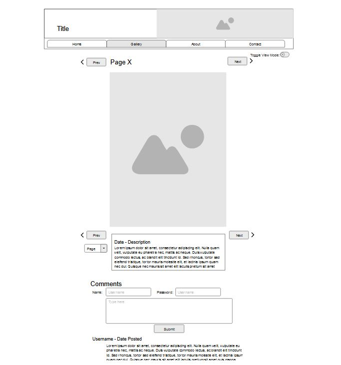

# Sundowner Webcomic Site

Wylie Hansen  
CS 408 - Final Project  
December 3, 2024  

## Overview

This is a webcomic site for a short 5 page comic. Pages include the index, which
has some general information and a page directory, the Gallery, where the comic pages
can be read and navigated, the comic index, which lists direct links to all pages and
can be filtered by tags, and the artist page, which gives more information about the artist.

## Running

This program can be run on a local server through VSCode's preview function.
Note that the preview function is only available with the Live Preview extension
installed.

With the extension installed, open a preview of index.html with the "Show
Preview" button, which should be in the upper right corner of the editor
workspace. You can then copy the url into your browser of choice.

## Usage

The home page is a directory, and includes links to the other pages in descriptive sections.

The Gallery page hosts the comic. The display shows one page at a time and the pages can be changed
with the arrow shaped buttons that appear at the top and bottom of the page. There is a list of
tags below the page, and clicking on the tags will link you to an index search for all other pages
with that tag. There is a comments section at the bottom, which shows a list of comments specific to
the current page and a form where you can submit your own comment.

The Comic Index page lets you see links to all comic pages displayed with thumbnails for the page. Clicking
on the link or the image will take you directly to the page. There is a search bar at the top of this page,
where you can filter the pages being displayed based on page tags.

The Artist page includes information about the artist along with image examples of other work. Clicking
on the example images will expand them, and clicking on them again will shrink them back down.

## Project Spec

For my final project I want to make a webcomic page. I do a lot of work with
illustration and comics, and if I ever want to do it professionally it'll be really
important for me to have a webpage where I can host my work and my portfolio. I
have a short 5 page comic I made over the Summer and I'm going to use that as my
fill-in content while building the site framework.

The biggest part of the project is the main comic gallery page.
The gallery will display individual pages from the comic, with controls for switching
between pages. There will be buttons to move to the next and previous page around the
page image itself, and the user will also be able to use the arrow keys to navigate.
There will be a toggleable option to switch how the pages are displayed, between an
"immersive" layout where two consecutive pages appear next to each other, more
optimized for wider screens, and a "standard" layout that shows one-page at a time.
I also want a comments section beneath each comic page, that's specific to each page.
If the user has the "immersive" spread display option enabled then the comments section
won't display, since comments correspond to a specific page. The gallery should work with
just one html file, so that moving between pages of the comic will involve loading in the
associated image file, description text, and reader comment text. The data that the website
handles will primarily be the images of the pages, as well as the text content that
goes with them. I'll need to figure out a format, probably some form of json, that I
can use to write and save page descriptions and associate them with the right image file.

Although the gallery page will be the focus, I want the Home page to be separate,
with a simpler design that directs the user to different parts of the site. It will include
a short description about the site and the comic and underneath it will have a list of navigation
links that let the user jump directly to any page. I also want a basic, separate "About Me"
page where I can include some other examples of my work and links to my social media.
The point of making this site would be to make my work accessible both for casual readers
and for potential employers, so while the one comic is the focus, I'd also want some way
that people interested in my stuff could see more of it.

The main target audience of the website is webcomic readers, which isn't exactly huge
but is still an established community that's already used to the design conventions that have
been standardized by other comic hosing sites. I'm using a lot of the same layout elements
that I see other artists using, like the central page, the arrow buttons, and the description,
because these are basic quality-of-life features that readers have learned to expect. There
are also a couple new features I don't see as often that I want to try, like the option to display
two pages at once like a physical book. The comments section is another thing that's common,
and that can help encourage readers to interact with and talk about the comic. However, since
this is also supposed to be a page I could show to employers as an example of my portfolio, I'd
want to have some kind of curation over the comments.

I'm considering that a flex goal because the comments are already kind of a secondary feature
next to the page gallery. If I do end up with the time I want to make the comments section more
robust, with some kind of basic username/password functionality that let's users comment with a
consistent profile instead of just anonymously. I mentioned I would also want to be able to curate
the comments, and that would involve implementing some kind of admin priveleges. I know that a lot
of webcomics use a pre-build comments plugin, so if I keep going in this direction that's
something I should look into implementing.

## Project Wireframe

## Sources
 - Gallery skeleton: https://github.com/geno7/Rarebit.git
 - HTML, CSS, and Javascript syntax: https://developer.mozilla.org/en-US/docs/Web/HTML
 - Starter code: https://github.com/shanep/cs408-final-project
